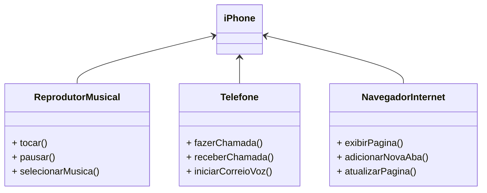

## UML com Mermaid
Importante ressaltar que mermaid não possui suporte a interfaces

```mermaid
classDiagram
    
    class ReprodutorMusical {
        + tocar()
        + pausar()
        + selecionarMusica()
    }

    class Telefone {
        + fazerChamada()
        + receberChamada()
        + iniciarCorreioVoz()
    }

    class NavegadorInternet {
        + exibirPagina()
        + adicionarNovaAba()
        + atualizarPagina()
    }

    class iPhone {

    }

    iPhone <-- ReprodutorMusical
    iPhone <-- Telefone
    iPhone <-- NavegadorInternet
```